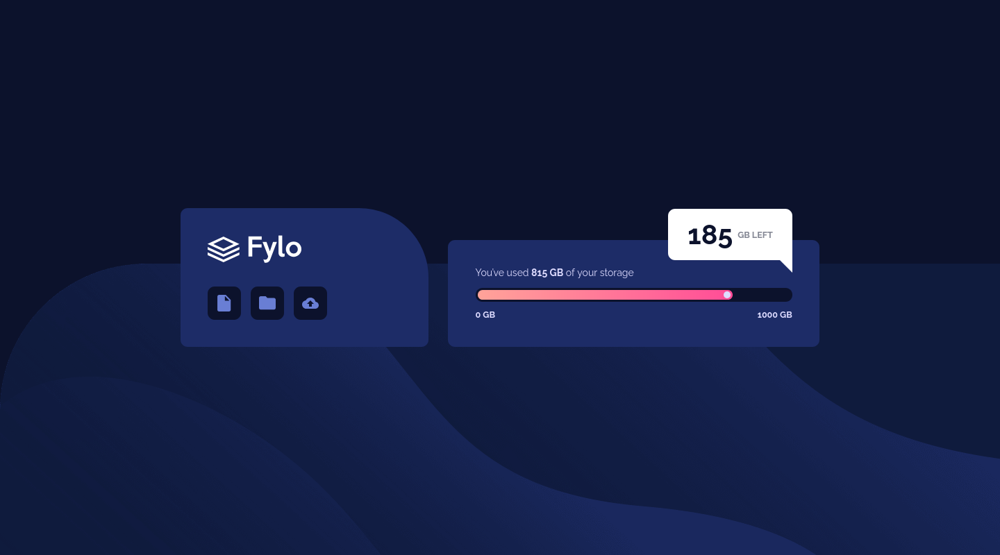
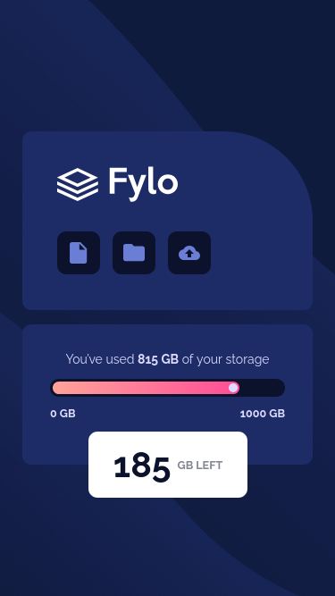

# Frontend Mentor - Fylo data storage component solution

This is a solution to the [Fylo data storage component challenge on Frontend Mentor](https://www.frontendmentor.io/challenges/fylo-data-storage-component-1dZPRbV5n). Frontend Mentor challenges help you improve your coding skills by building realistic projects. 

## Table of contents

- [Frontend Mentor - Fylo data storage component solution](#frontend-mentor---fylo-data-storage-component-solution)
  - [Table of contents](#table-of-contents)
  - [Overview](#overview)
    - [The challenge](#the-challenge)
    - [Screenshot](#screenshot)
    - [Links](#links)
  - [My process](#my-process)
    - [Built with](#built-with)
    - [What I learned](#what-i-learned)
    - [Continued development](#continued-development)
    - [Useful resources](#useful-resources)
    - [AI Collaboration](#ai-collaboration)
  - [Author](#author)
  - [Acknowledgments](#acknowledgments)

## Overview

### The challenge

Users should be able to:

- View the optimal layout for the site depending on their device's screen size

### Screenshot




### Links

- Solution URL: [GitHub](https://github.com/juanhastier/fylo-data-storage-component)
- Live Site URL: [Fylo data storage component](https://juanhastier.github.io/fylo-data-storage-component)

## My process

### Built with

- Semantic HTML5 markup
- CSS custom properties (variables)
- Flexbox
- Mobile-first workflow
- BEM methodology
- ARIA accessibility attributes

### What I learned

This project helped me practice and solidify key frontend development skills.

**Responsive scaling strategy:**  
I used a mobile-first approach with a base `font-size` of 14px on the `html` element. For desktop, I adjusted the layout structure (flex-direction: row) and background positioning to match the design.

**Positioning complex UI elements:**  
The bubble with "185 GB Left" needs to be positioned differently on mobile (centered below the progress bar) and on desktop (floating above the storage card). I used `position: absolute` with different `inset` values in the media query to achieve this.

**CSS pseudo-elements for decorative shapes:**  
I created the white circle on the progress bar using `::after` and the triangle pointing to the bubble also with `::after`, using `clip-path` to shape it.

**Accessible progress bar:**  
I added `role="progressbar"` along with `aria-valuenow`, `aria-valuemax`, and `aria-valuetext` to make the storage usage understandable for screen readers.

```html
<div class="progress-bar" 
    role="progressbar" 
    aria-valuenow="815" 
    aria-valuemax="1000" 
    aria-valuetext="81.5 percent used">
  <div class="progress-bar__fill"></div>
</div>
```

### Continued development

I plan to keep improving my frontend skills by focusing on:

- **CSS architecture:** Deepen my knowledge of BEM and explore utility-first frameworks like Tailwind CSS.
- **Accessibility:** Test ARIA implementations with real screen readers (NVDA, VoiceOver).
- **JavaScript interactivity:** Build more dynamic components (modals, carousels) with vanilla JS before moving to frameworks.
- **Performance:** Learn about CSS containment (contain) and optimizing background images.

### Useful resources

- [MDN Web Docs](https://developer.mozilla.org/) - I really enjoyed studying on MDN, and I will continue to use it in the future.
- [CSS Tricks: CSS Flexbox Layout Guide](https://css-tricks.com/snippets/css/a-guide-to-flexbox/) - This is an amazing article which helped me finally understand flexbox layout. I'd recommend it to anyone still learning this concept.
- [CSS Tricks: CSS Grid Layout Guide](https://css-tricks.com/complete-guide-css-grid-layout/) - This is an amazing article which helped me finally understand grid layout. I'd recommend it to anyone still learning this concept.


### AI Collaboration

I used DeepSeek as an AI assistant throughout this project:

- **Brainstorming solutions:** Discussed different approaches for positioning the bubble and styling the progress bar.
- **Debugging:** Resolved issues with clip-path for the triangle and background-position for the desktop background.
- **Code review:** Received feedback on HTML semantics, ARIA attributes, and CSS organization (BEM, variables).
- **Learning:** Explored modern CSS features like :has() and clip-path.

**What worked well:**
The AI was helpful for clarifying concepts, exploring trade-offs between different solutions, and catching small mistakes.

**What didn't work well:**
Some suggestions were too generic or didn't fit the specific design; I had to filter and adapt them manually.

**Overall:**
Using AI as a pair programming assistant accelerated my learning and helped me produce a more polished final solution.

## Author

- Github - [juanhastier](https://github.com/juanhastier)
- Frontend Mentor - [@juanhastier](https://www.frontendmentor.io/profile/juanhastier)
- Linkedin - [juanhastier](https://www.linkedin.com/in/juanhastier/)

## Acknowledgments

- **Frontend Mentor** – for the challenge and design assets.
- **DeepSeek (AI assistant)** – for helping me brainstorm, debug, and review the code.
- **MDN Web Docs** – for documentation on ARIA attributes, clip-path, and CSS positioning.
- **Google Fonts** – for the Raleway typeface.
